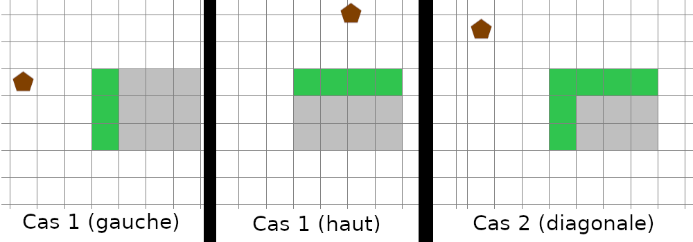

\title{Race - Readme}
\author{Nathanaël Houn, Valentin Perignon}
\maketitle

# Construire le projet
Exécuter à la racine du projet la commande :
```bash
make
```

# Liste des joueurs réalisé
 - **slow.c** : premier joueur réalisé, il se déplace avec une vitesse constante de |1|. Équivalent à *race-dumb*.
 - **cugnot.c** : le joueur adapte sa vitesse en fonction de sa distance à l'objectif pour réduire le nombre de coups.
 - **multipla.c** : en plus d'augmenter sa vitesse, le joueur sélectionne parmi les cases de la cible celle qui possède le plus faible score sur les bords de la cible.
 - **trottinette.c** : _En cours de développement_ Accélère autant tant qu'il touche la cible et ne sort pas du terrain. Ne choisit pas de meilleure case.

# Nos algorithmes

## Adapter la vitesse - cugnot et multipla
Fonction dans le code : *update_speed()*.

Tout au long du jeu, le joueur adapte sa vitesse en fonction de sa position par rapport au checkpoint.
À chaque coup, la distance de freinage est calculée en utilisant la formule des n premiers entiers. Par exemple, si la vitesse du joueur est de 3, alors la distance de freinage est de *3+2+1=6*.
Si cette distance est inférieure à la distance avec l'objectif, le joueur réduit sa vitesse.

## Trouver la meilleure case de l'objectif - multipla
Fonction dans le code : *target_optimise*.

Pour réduire le score, le joueur cherche, à chaque fois qu'une nouvelle cible est disponible, la case qui contient la plus faible valeur.  
Selon l'algorithme de régulation de la vitesse, le joueur arrive dans l'objectif avec une vitesse de |1|. Celui-ci ne peut donc toucher que les cases du bord de la direction dans laquelle il arrive.
L'algorithme sélectionne la case avec le plus faible poid en réduisant la recherche aux cases accessibles.  
Il existe deux cas. Soit le joueur arrive face à l'objectif (depuis la gauche, la droite, le haut ou le bas), dans ce cas la recherche se limite à une ligne ou colonne (celle qui lui fait face). Soit le joueur arrive depuis une diagonale, dans ce cas la recherche se fait sur une ligne et une colonne (les deux qui sont accessibles). Voir figure \ref{meilleurecase} (les cases accessibles sont en vert).


